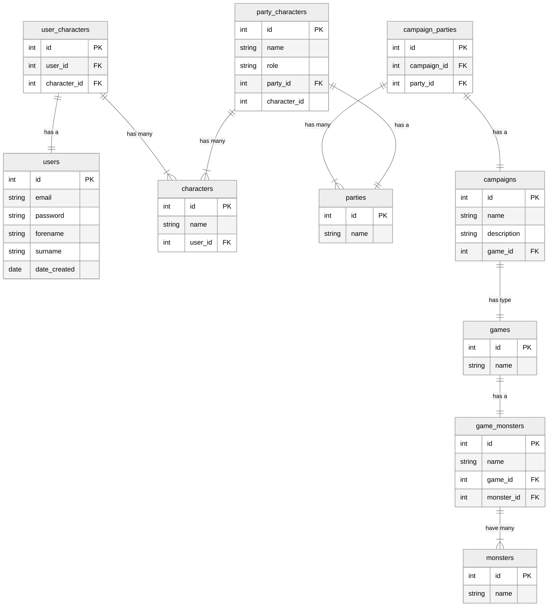

# D&D Companion Tool Migrations
This ER diagram was prepared using Mermaid

```mermaid
%%{init: {'theme':'neutral'}}%%
erDiagram
    users {
        int id PK 
        string email
        string password
        string forename
        string surname
        date date_created
    }
    characters {
        int id PK
        string name
        int user_id FK
    }
    user_characters ||--|| users : "has a"
    user_characters ||--|{ characters : "has many"
    user_characters {
        int id PK
        int user_id FK
        int character_id FK
    }
    parties {
        int id PK
        string name
    }
    campaigns ||--|| games : "has type"
    campaigns {
        int id PK
        string name
        string description
        int game_id FK
    }
    campaign_parties ||--|| campaigns : "has a"
    campaign_parties ||--|{ parties : "has many"
    campaign_parties {
        int id PK
        int campaign_id FK
        int party_id FK
    }
    party_characters ||--|| parties : "has a"
    party_characters ||--|{ characters : "has many"
    party_characters {
        int id PK
        string name
        string role
        int party_id FK
        int character_id
    }
    monsters {
        int id PK
        string name
    }
    games ||--|| game_monsters : "has a"
    games {
        int id PK 
        string name
    }
    game_monsters ||--|{ monsters : "have many"
    game_monsters {
        int id PK
        string name
        int game_id FK
        int monster_id FK
    }
```
